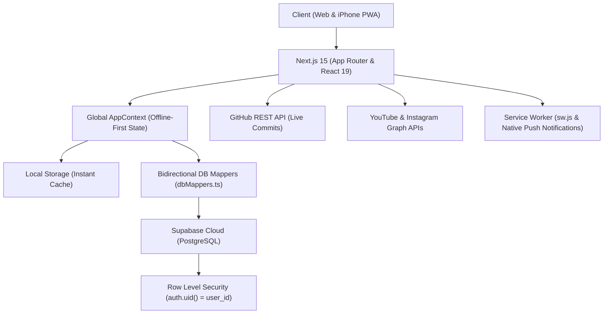

# ⚡ Pulse — Modern Personal Life & Work OS

<p align="center">
  
</p>

<p align="center">
  <strong>A unified, minimalist command center engineered for software developers, students, freelance creators, and high performers.</strong>
</p>

<p align="center">
  <a href="https://nextjs.org"></a>
  <a href="https://react.dev"></a>
  <a href="https://www.typescriptlang.org"></a>
  <a href="https://tailwindcss.com"></a>
  <a href="https://supabase.com"></a>
  <a href="https://developer.mozilla.org/en-US/docs/Web/Progressive_web_apps"></a>
  <a href="#license"></a>
</p>

---

## 📖 Overview

**Pulse** is a hyper-personalized, distraction-free **Life & Work Operating System** inspired by the minimalism of Notion and Linear. Modern professionals and university students often juggle fragmented tools across Jira, Google Calendar, Notion, spreadsheet trackers, banking apps, and social analytics. 

Pulse consolidates your entire digital workflow into a single, lightning-fast dashboard that works seamlessly across desktop and mobile.

Built with **Next.js 15 (App Router)**, **TypeScript**, **Tailwind CSS**, and **Supabase (PostgreSQL + RLS)**, Pulse is offline-first, production-secure, and installable as a native Progressive Web App (PWA) on iPhone and Android.

---

## ✨ Core Workspaces & Features

### 1. ⚡ Command Center & Daily Focus (`/dashboard`)
- **Daily Focus Priority Queue**: Track your top high-impact tasks for the day with priority indicators and category badges.
- **Cross-Workspace Executive Metrics**: Live aggregates of active code repositories, pending client deliverables, upcoming university exams, and net balance.
- **Quick-Task Ingestion**: Inline rapid task creation without modal friction.

### 2. 💻 Software Engineering & Live GitHub Feed (`/projects`)
- **Repository Portfolio**: Catalog full-stack web applications, mobile apps, backend services, and AI/ML experiments.
- **Real-Time GitHub Commits**: Direct GitHub REST API integration pulling the latest commits, authors, and timestamps dynamically.
- **Milestone Progress Tracking**: Subtask completion bars, live deployment URLs, and tech-stack pills.

### 3. 🎓 Academic & University Life OS (`/school`)
- **Course & Classroom Management**: Track semester courses, instructors, ECTS credits, target letter grades, and **exact classroom / lecture hall locations** (e.g., *Amphi 2*, *B-204*).
- **Weekly Schedule & Automated 15-Minute Pre-Class Push Notifications**: Background engine checks class schedules and automatically fires a push alert to your phone **15 minutes before lecture start** with room details.
- **Exam & Assignment Countdowns**: Dynamic countdown badges for Midterms, Finals, Project Submissions, and Quizzes.

### 4. 🎨 Freelance Design CRM (`/clients`)
- **Order Pipeline & Deliverables**: Track client branding, social media posts, UI/UX mockups, and video assets from brief ingestion to delivery.
- **Payment & Accounts Receivable**: Monitor total project values, advance deposits received, remaining balances, and payment statuses (*Paid*, *Partial*, *Pending*).
- **Direct Asset Vault**: Direct links to client Figma files, Google Drive folders, and deliverables.

### 5. 📹 Creator Studio & Social Media (`/content`)
- **Multi-Platform Content Funnel**: Organize ideas across Instagram, YouTube, TikTok, X, and LinkedIn (*Idea → Script → Production → Editing → Scheduled → Published*).
- **Live Social Media Metrics**: Connect YouTube Data API v3 and Instagram Graph API to display live subscriber counts, total views, and engagement metrics directly on your dashboard.

### 6. 💰 Financial Analytics & Interactive Donut Chart (`/finance`)
- **Real-Time Cash Flow**: Record freelance income, software subscriptions, academic expenses, and living costs.
- **Interactive Breakdown Donut Chart**: Hover-interactive category analysis powered by Chart.js with dynamic balance calculation and color-coded categorizations.

### 7. 📝 Idea Vault & Markdown Notes (`/notes`)
- **Distraction-Free Scratchpad**: Capture thoughts, architecture notes, and meeting memos with searchable tags and one-click pinning.

---

## 📱 Mobile PWA & iPhone 12 Ergonomics

Pulse is meticulously designed for single-handed mobile usage on modern devices, specifically calibrated for the **iPhone 12 (390px viewport)**:
- **7-Tab Thumb-Zone Bottom Bar**: Rapid switching between *Overview, Software, School, Clients, Content, Finance,* and *Notes*.
- **iOS Safe-Area Compliance**: Full integration with `env(safe-area-inset-bottom, 16px)` to prevent interference with the iOS home indicator bar.
- **Collapsible Desktop Sidebar (`Ctrl+\` or `Ctrl+B`)**: Distraction-free full-screen workspace with an instant re-open button and keyboard shortcuts.
- **Automated PWA Push Notification Engine**:
  - **08:00 Morning Briefing**: Focus tasks, urgent client deliverables, and exams due today.
  - **20:00 Evening Review**: Summary of completed tasks and accomplishments.
  - **Pre-Class Alerts**: Room location and start-time warning 15 minutes before university lectures.

---

## 🛠️ Architecture & Tech Stack



- **Framework**: [Next.js 15.5](https://nextjs.org/) (App Router, Server & Client Components)
- **Frontend**: [React 19](https://react.dev/), [Tailwind CSS 3.4](https://tailwindcss.com/)
- **Icons**: [Lucide React](https://lucide.dev/)
- **Data Visualization**: [Chart.js](https://www.chartjs.org/) + [react-chartjs-2](https://react-chartjs-2.js.org/)
- **Backend & Authentication**: [Supabase](https://supabase.com/) (PostgreSQL with strict Row Level Security)
- **PWA Engine**: Service Worker API, Push Notifications API, Web App Manifest

---

## 🚀 Quickstart & Local Setup

### 1. Clone & Install Dependencies
```bash
# Clone the repository
git clone https://github.com/yunusemre-celik/pulse-life-work-os.git

# Navigate to project directory
cd pulse-life-work-os

# Install dependencies
npm install
```

### 2. Configure Environment Variables
Copy the example environment file:
```bash
cp .env.local.example .env.local
```
Edit `.env.local` with your Supabase credentials:
```env
NEXT_PUBLIC_SUPABASE_URL=https://your-project-id.supabase.co
NEXT_PUBLIC_SUPABASE_ANON_KEY=your-anon-public-key
```

> [!NOTE]
> Even without initial Supabase credentials, Pulse operates out-of-the-box in **Guest / Local Mode**, storing all state in browser `localStorage`.

### 3. Run Development Server
```bash
npm run dev
```
Open [http://localhost:3000](http://localhost:3000) in your browser.

---

## ☁️ Supabase Cloud Database & RLS Setup

1. Create a free project on [Supabase](https://supabase.com).
2. Open the **SQL Editor** in your Supabase project dashboard.
3. Paste the contents of [`supabase_schema.sql`](./supabase_schema.sql) and click **Run**.
   - *This creates all 8 relational tables (`focus_tasks`, `projects`, `courses`, `academic_tasks`, `client_orders`, `content_items`, `transactions`, `quick_notes`), indexes, and enables strict Row Level Security (RLS) policies.*
4. Retrieve your **Project URL** and **`anon` public key** from **Project Settings → API**.

---

## 🌐 Deploy to Vercel in 2 Minutes

[](https://vercel.com/new)

1. Push this repository to your GitHub account.
2. Sign in to [Vercel](https://vercel.com) and click **"Add New Project"**.
3. Import your repository.
4. Under **Environment Variables**, provide:
   - `NEXT_PUBLIC_SUPABASE_URL`
   - `NEXT_PUBLIC_SUPABASE_ANON_KEY`
5. Click **Deploy**. Your app is live with SSL, global CDN, and automated CI/CD!

---

## 📱 Installing on iPhone 12 (iOS Safari PWA)

1. Open your production URL in **Safari** on your iPhone.
2. Tap the **Share** button (box with an upward arrow).
3. Scroll down and tap **"Add to Home Screen"** (*Ana Ekrana Ekle*).
4. Launch the app from your home screen. Pulse will launch in **standalone full-screen mode** without browser address bars or navigation clutter.
5. Tap **Allow Notifications** to enable the automated 08:00, 20:00, and 15-minute pre-class lecture alerts.

## 📦 Toplu Veri Yükleme, Yedekleme & JSON Şeması (Bulk Data Import & Backup)

Pulse, kullanıcıların verilerini tek tek form doldurmak yerine **toplu JSON içe aktarma** veya **tek tıkla JSON yedekleme** yöntemiyle zahmetsizce yönetebilmesini sağlar. Projeyi klonlayan başka bir geliştirici ya da kullanıcı kendi verilerini saniyeler içinde içeri aktarabilir.

### 1. Arayüzden Nasıl İçe Aktarılır?
1. Pulse arayüzünde sol alttaki (veya mobilde sağ üstteki) **Ayarlar & DB (Çark)** butonuna tıklayın.
2. Sayfayı en alta kaydırarak **"Veri Yedekleme & İçe Aktarma"** bölümüne gelin.
3. Kendi verilerinizi içeren JSON metnini kutuya yapıştırıp **"İçe Aktar"** butonuna basın.
4. Veriler anında çalışma alanlarınıza yüklenecek ve eğer Supabase oturumunuz açıksa bulut veritabanınızla otomatik senkronize edilecektir!
5. Mevcut verilerinizi tek tıkla cihazınıza kaydetmek için **"Yedek İndir (JSON)"** butonunu kullanabilirsiniz.

### 2. Hazır Şablon Dosyası (`sample-import.json`)
Projeyle birlikte gelen [`sample-import.json`](./sample-import.json) dosyasını açıp kendi derslerinizi, projelerinizi ve siparişlerinizi doldurarak doğrudan kopyalayıp içe aktarabilirsiniz.

### 3. JSON Veri Yapısı (Schema Özeti)
```json
{
  "focusTasks": [
    {
      "id": "tsk-1",
      "title": "Bugünün öncelikli işi",
      "completed": false,
      "priority": "high",
      "category": "dev",
      "dueDate": "2026-09-30"
    }
  ],
  "projects": [
    {
      "id": "prj-1",
      "name": "Yazılım Projesi",
      "description": "Açıklama",
      "category": "Web App",
      "status": "Geliştirmede",
      "techStack": ["Next.js", "TypeScript", "Tailwind CSS"],
      "githubUrl": "https://github.com/...",
      "liveUrl": "https://...",
      "progress": 80,
      "tasks": [{ "id": "t-1", "title": "Alt görev", "completed": false }]
    }
  ],
  "courses": [
    {
      "id": "crs-1",
      "name": "Yazılım Mimarisi",
      "code": "CENG-401",
      "classroom": "Amfi 2 (B-Blok)",
      "dayOfWeek": "Pazartesi",
      "startTime": "09:30",
      "endTime": "12:20",
      "credits": 4,
      "ects": 6,
      "letterGradeGoal": "AA",
      "status": "Devam Ediyor"
    }
  ],
  "academicTasks": [
    {
      "id": "act-1",
      "courseName": "Yazılım Mimarisi",
      "title": "Vize Sınavı",
      "type": "Vize",
      "dueDate": "2026-11-15",
      "isCompleted": false
    }
  ],
  "clientOrders": [
    {
      "id": "ord-1",
      "clientName": "Müşteri Adı",
      "projectTitle": "Sosyal Medya Tasarımı",
      "designType": "Instagram Post / Carousel",
      "status": "Taslak Hazır",
      "price": 5000,
      "paidAmount": 2500,
      "paymentStatus": "Kısmi Ödeme",
      "deliveryDate": "2026-10-05"
    }
  ],
  "contentItems": [
    {
      "id": "cnt-1",
      "title": "YouTube Video Fikri",
      "platform": "YouTube",
      "format": "Uzun Video",
      "status": "Senaryo",
      "scheduledDate": "2026-10-10"
    }
  ],
  "transactions": [
    {
      "id": "tx-1",
      "title": "Freelance Geliri",
      "type": "income",
      "amount": 2500,
      "category": "Müşteri Tasarım",
      "date": "2026-09-25"
    }
  ],
  "notes": [
    {
      "id": "not-1",
      "title": "Not Başlığı",
      "content": "Not içeriği...",
      "tags": ["Planlama"],
      "isPinned": true
    }
  ]
}
```

---

## 🔒 Security & Privacy Architecture

- **Row Level Security (RLS)**: Every SQL table has RLS enforced. Users can only access records where `auth.uid() = user_id`.
- **Zero Mock / Demo Data in Production**: The codebase ships as a clean, blank slate ready for real personal data.
- **Client-Side Secrets Protection**: The `service_role` and admin secret keys are strictly omitted from client code. `.env*` files are sealed by `.gitignore`.

---

## 📄 License

Distributed under the **MIT License**. See [`LICENSE`](./LICENSE) for more information.

---

<p align="center">
  Crafted with care by <strong><a href="https://github.com/yunusemre-celik">Yunus Emre Çelik</a></strong><br/>
  Feel free to star ⭐ this repository if you find it helpful!
</p>
